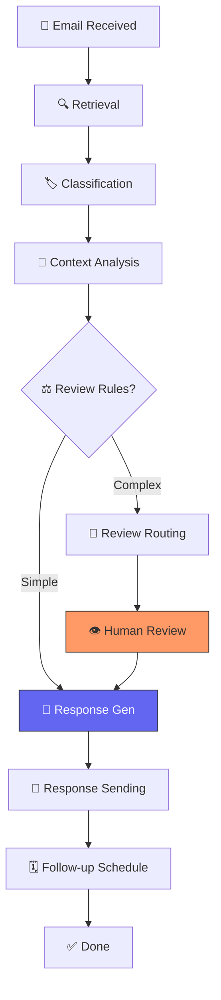

# 🤖 Agentic AI Customer Support Email Agent

A high-performance, **Agentic AI** system designed to automate customer support workflows. This agent processes incoming emails through a sophisticated **10-node LangGraph pipeline**, utilizing semantic search, LLM-based classification, and human-in-the-loop validation to deliver accurate, context-aware responses.

 *(Note: Please generate or add a preview image here)*

## 🌟 Key Features

### 🧠 Intelligent Processing
- **Automated Classification**: Uses LLMs to categorize emails (Inquiry, Complaint, Refund, etc.) and assign priorities (Urgent, High, Medium, Low).
- **Context-Aware Analytics**: Leverages **FAISS** vector search to retrieve relevant company knowledge and customer history.
- **Dynamic Decision Making**: Automatically flags complex cases for human review based on confidence scores and business rules.

### 🖥️ Modern Dashboard (Glassmorphism UI)
- **Real-time Pipeline Tracking**: Visualize the AI's internal thought process as it moves through the graph nodes.
- **Advanced Filtering & Search**: Instant categorical filtering (Category, Priority, Status) and text search across hundreds of records.
- **Dark & Light Mode**: Seamlessly toggle between a sleek dark glass theme and a crisp light theme.
- **Interactive History**: View full email threads, AI chain-of-thought, and reviewer notes in structured modals.

### 🤝 Human-in-the-Loop (HITL)
- **Review Dashboard**: A dedicated space for support agents to edit and approve AI-generated drafts.
- **Workflow Escalation**: Automated routing of sensitive or low-confidence emails to the human queue.

---

## 🏗 Architecture & Workflow

The agent operates as a **State Machine** orchestrated by **LangGraph**.



### The 10 Nodes of Intelligence
1.  **`email_retrieval`**: Ingests raw email data into the workflow state.
2.  **`classification`**: Determines the intent and urgency using GPT-4o-mini.
3.  **`context_analysis`**: Performs FAISS vector similarity search for knowledge retrieval.
4.  **`review_check`**: Checks business logic (e.g., refund requests always need review).
5.  **`response_generation`**: Drafts a polite, professional response based on retrieved context.
6.  **`review_routing`**: Persists the draft to the database for human escalation.
7.  **`human_review`**: Acts as a gatekeeper for final consistency and tone.
8.  **`response_sending`**: Coordinates with the email service to dispatch the reply.
9.  **`followup_scheduling`**: Creates automated check-ins based on the email category.
10. **`error_handler`**: Graceful failure management and logging.

---

## 🛠 Tech Stack

- **Framework**: [LangGraph](https://python.langchain.com/docs/langgraph) (Workflow Orchestration)
- **API**: [FastAPI](https://fastapi.tiangolo.com/) (Async Python Backend)
- **AI Models**: OpenAI GPT-4o-mini (Intelligence) & Text-Embedding-3-Small (Embeddings)
- **Database**: [SQLAlchemy](https://www.sqlalchemy.org/) + SQLite (Persistence)
- **Vector Store**: [FAISS](https://github.com/facebookresearch/faiss) (Semantic Search)
- **Frontend**: Vanilla HTML5/CSS3 (Glassmorphism design) & Modern JavaScript

---

## 🚀 Quick Start

### 1. Prerequisites
- Python 3.9+
- OpenAI API Key

### 2. Installation
```bash
# Clone the repository
git clone <your-repo-url>
cd email-generator

# Install dependencies
pip install -r requirements.txt
```

### 3. Configuration
Create a `.env` file in the root directory:
```env
OPENAI_API_KEY=your_key_here
DATABASE_URL=sqlite+aiosqlite:///./emails.db
ENVIRONMENT=development
```

### 4. Seed the Knowledge Base
Populate the FAISS vector store with your company's documentation:
```bash
python scripts/populate_knowledge_base.py
```

### 5. Run the Application
```bash
python main.py
```
The dashboard will be available at **http://localhost:8000**.

---

## 🧑‍💻 API Documentation

| Method | Endpoint | Description |
|--------|----------|-------------|
| `POST` | `/api/emails/test` | Submit a raw email string for AI processing |
| `GET`  | `/api/emails/history` | Retrieve full processing history & stats |
| `GET`  | `/api/emails/{id}` | Get deep-dive details for a specific email |
| `GET`  | `/api/reviews/pending` | List all emails awaiting human approval |
| `POST` | `/api/reviews/{id}/approve` | Send an edited/approved human response |

---

## 📄 License
MIT License - Developed for AI-driven customer excellence.

