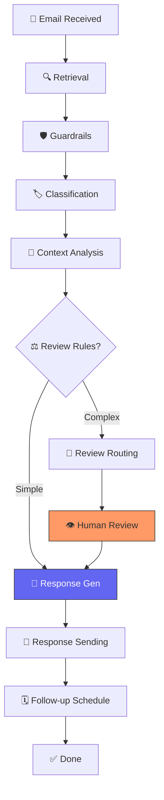

# 🤖 Agentic AI Customer Support Email Agent

A high-performance, **Agentic AI** system designed to automate customer support workflows. Powered by a **10-node LangGraph pipeline**, this agent processes incoming emails with semantic precision, utilizing LLM-based classification, FAISS-driven retrieval, and a human-in-the-loop validation layer.

## 🌟 Key Features

- **Modular Workflow**: 10 specialized nodes for retrieval, guardrails, classification, and generation.
- **Real-time Streaming**: Watch the AI's "Chain of Thought" as it progresses through each node on the dashboard.
- **Semantic Search**: Integrated **FAISS** vector store for instant retrieval of company knowledge.
- **Human-in-the-Loop (HITL)**: Dedicated review queue for sensitive or complex cases.
- **Observability**: Full tracing and logging via **LangSmith**.

---

## 🧠 Pipeline Architecture & Significance

The heart of this system is a 10-node directed graph. Each step is carefully designed to ensure safety, accuracy, and efficiency.

### 1. 🔍 Email Retrieval
- **Significance**: The entry point. It pulls raw email from the database and initializes the Agent's state. 
- **Necessity**: Without this, the agent has no context on the sender or subject.

### 2. 🛡️ Guardrails
- **Significance**: Safety and Compliance layer.
- **Necessity**: Screens for PII, toxicity, or inappropriate requests *before* LLM processing to protect brand and privacy.

### 🏷️ 3. Classification
- **Significance**: The "Intent Engine".
- **Necessity**: Categorizes the email and assigns priority, determining the logic path (e.g., Billing vs. Technical Support).

### 📁 4. Context Analysis
- **Significance**: The "Memory & Knowledge" layer.
- **Necessity**: Performs semantic search in FAISS and looks up customer history to ensure responses are personalized and grounded in facts.

### ⚖️ 5. Review Check
- **Significance**: The "Self-Awareness" gate.
- **Necessity**: Evaluates if the AI is confident enough to reply auto-matically or if it needs a human expert based on classification scores.

### 🤖 6. Response Generation
- **Significance**: The "Drafting Engine".
- **Necessity**: Synthesizes email content, retrieved knowledge, and history into a professional, helpful draft.

### 👮 7. Review Routing
- **Significance**: The "Escalation Manager".
- **Necessity**: Manages the transition from AI to human by creating review records when confidence is low.

### 👁️ 8. Human Review (HITL)
- **Significance**: Quality Control.
- **Necessity**: Provides a safety net for high-stakes interactions, allowing humans to edit or approve AI drafts.

### 📧 9. Response Sending
- **Significance**: Fulfillment.
- **Necessity**: Finalizes the database status and triggers the actual email transmission to the customer.

### 🗓️ 10. Follow-up Scheduling
- **Significance**: Customer Success.
- **Necessity**: Automatically schedules check-ins (e.g., for tech issues) to ensure long-term resolution.

---

## 🏗 Workflow Diagram



## 🛠 Tech Stack

- **Core**: Python 3.9+, [LangGraph](https://python.langchain.com/docs/langgraph)
- **Intelligence**: OpenAI GPT-4o-mini, Text-Embedding-3-Small
- **Observability**: [LangSmith](https://smith.langchain.com/)
- **API Backend**: [FastAPI](https://fastapi.tiangolo.com/)
- **Database**: [SQLAlchemy](https://www.sqlalchemy.org/) (Async), SQLite
- **Vector Search**: [FAISS](https://github.com/facebookresearch/faiss)
- **Frontend**: Vanilla CSS (Glassmorphism), Modern JavaScript

## 🚀 Quick Start

### 1. Installation
```bash
git clone <repository-url>
cd email-generator
pip install -r requirements.txt
```

### 2. Configuration
Create a `.env` file:
```env
OPENAI_API_KEY=your_key
LANGCHAIN_TRACING_V2=true
LANGCHAIN_API_KEY=your_langsmith_key
LANGCHAIN_PROJECT=email-agent-demo
DATABASE_URL=sqlite+aiosqlite:///./email_agent.db
KB_INDEX_PATH=./data/faiss_index
KB_DOCUMENTS_PATH=./data/kb_documents.json
```

### 3. Execution
```bash
python scripts/populate_knowledge_base.py
python main.py
```
Visit **[http://localhost:8000](http://localhost:8000)**.

## 🧑‍💻 API Endpoints

| Method | Endpoint | Description |
|--------|----------|-------------|
| `POST` | `/api/emails/test/stream` | Process email with real-time updates |
| `GET`  | `/api/emails/history` | Get full history & stats |
| `GET`  | `/api/reviews/pending` | List emails awaiting human approval |

## 📄 License
MIT License
